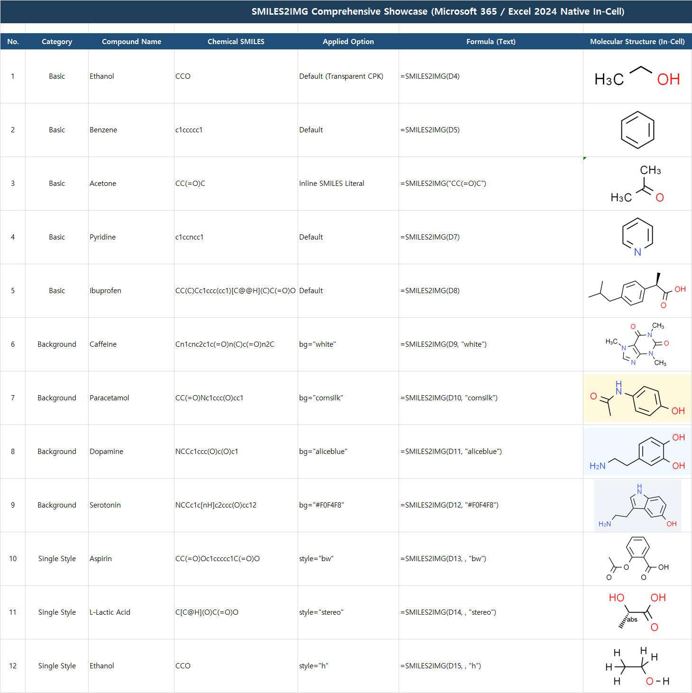
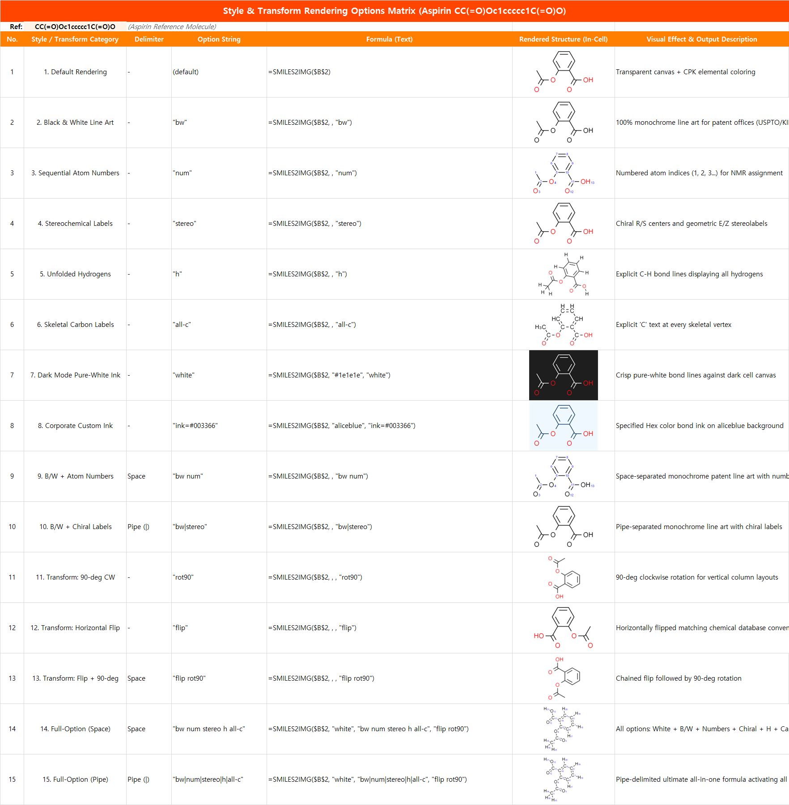
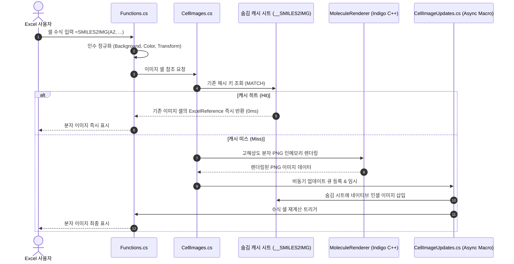

# SMILES2IMG — Excel 분자 구조식 자동 렌더러

[English](README.md) | **한국어**

[-blue.svg)](#실행-요구사항)
[](https://dotnet.microsoft.com/)
[](https://excel-dna.net/)
[](https://lifescience.opensource.epam.com/indigo/)
[](#-빠른-시작-설치-방법)

> **SMILES 화학 구조식 문자열을 Excel 셀 안의 고해상도 인셀(In-Cell) 분자 이미지로 즉시 변환하는 Excel 추가 기능(Add-in)입니다.**  
> 외부 웹 서버나 클라우드 전송 없이, PC 로컬에서 100% 오프라인으로 안전하고 빠르게 렌더링됩니다.

<p align="center">
  
</p>

---

## 📑 목차
- [🚀 빠른 시작 (설치 방법)](#-빠른-시작-설치-방법)
- [💡 사용 방법 및 수식 IntelliSense](#-사용-방법-및-수식-intellisense)
- [📖 함수 구문 및 인자 규격](#-함수-구문-및-인자-규격)
- [🎨 주요 활용 레시피 (실전 예시)](#-주요-활용-레시피-실전-예시)
- [🔬 화학 구조 렌더링 최적화 (ACS 저널 표준)](#-화학-구조-렌더링-최적화-acs-저널-표준)
- [🏗️ 내부 아키텍처 및 동작 원리](#️-내부-아키텍처-및-동작-원리)
- [📂 프로젝트 디렉터리 구조](#-프로젝트-디렉터리-구조)
- [🛠️ 빌드 및 배포 방법 (개발자용)](#️-빌드-및-배포-방법-개발자용)
- [🧪 자동화 테스트 및 검증](#-자동화-테스트-및-검증)
- [❓ 자주 묻는 질문 (FAQ)](#-자주-묻는-질문-faq)

---

## 🚀 빠른 시작 (설치 방법)

### 실행 요구사항

| 항목 | 필요한 환경 |
| :--- | :--- |
| Windows | Windows 10 또는 11; Windows 11 권장 |
| Excel (인셀 이미지 모드) | 네이티브 셀 내 이미지 기능을 지원하는 **Excel 2024 이상** 및 **Microsoft 365 데스크톱** (`=SMILES2IMG`) |
| Excel (플로팅 이미지 모드) | 셀 크기에 연동되는 플로팅 그림을 지원하는 **Excel 2016, 2019, 2021** (`=SMILES2IMG.FLOAT`) |
| 런타임 | **.NET Framework 4.8 이상** |
| Excel 비트수 | **32비트·64비트 모두** 배포 파일 제공; Excel 비트수에 맞는 XLL 선택 |

**하나의 XLL 파일로 Excel 2016부터 최신 Microsoft 365까지 모두 지원합니다:**
* **Excel 2024 / Microsoft 365:** `=SMILES2IMG(A2)`를 사용하면 Excel의 네이티브 '셀에 그림 배치' 기능으로 셀 안에 이미지가 쏙 들어갑니다.
* **Excel 2016 / 2019 / 2021:** 인셀 이미지를 미지원하는 구버전에서는 `=SMILES2IMG.FLOAT(A2)`를 사용합니다. 셀 위에 분자 그림이 배치되며, 셀 이동 및 행/열 크기 변경에 연동(`xlMoveAndSize`)됩니다. 만약 구버전에서 실수로 `SMILES2IMG`를 호출하더라도 오류 대신 `Needs Excel 2024/365: use SMILES2IMG.FLOAT`라는 친절한 안내 문구가 표시됩니다.
* 이 추가 기능은 Windows 데스크톱 Excel 전용이며, Mac용 Excel과 웹용 Excel에서는 XLL을 로드할 수 없습니다. 다운로드한 XLL을 사용하기 위해 개발용 **.NET SDK를 설치할 필요는 없습니다.**

### ⚡ 방법 A: 원클릭 자동 설치 및 업데이트 (가장 추천)

PowerShell을 열고 아래 명령어 **한 줄만 실행**하면 모든 과정이 자동으로 완료됩니다:

```powershell
irm https://raw.githubusercontent.com/naramdash/func_SMILES2IMG/main/install.ps1 | iex
```

> **스크립트가 자동으로 처리하는 내용:**  
> 1. 내 Excel 비트수(32비트 vs 64비트) 자동 감지  
> 2. `%APPDATA%\Microsoft\AddIns` 표준 안전 폴더로 최신 XLL 다운로드 및 자동 갱신  
> 3. Windows 보안 차단(`Unblock-File`) 자동 해제  
> 4. Excel 추가 기능 레지스트리 자동 등록 (Excel 실행 시 즉시 로드)  
>  
> 💡 **최신 버전 업데이트:** 이미 설치되어 있는 상태에서 위 명령어를 다시 실행하면, 최신 버전으로 안전하게 자동 업데이트됩니다.  
> 🗑️ **삭제 방법:** 리포지토리의 `.\uninstall.ps1`을 실행하면 파일과 레지스트리가 깔끔하게 제거됩니다.

---

### 🖐️ 방법 B: 수동 설치 (단계별 안내)

#### 1단계: 내 Excel 비트수(32비트 vs 64비트) 확인
1. Excel 실행 후 **[파일] → [계정] → [Excel 정보]** 클릭
2. 팝업 창 첫 줄 끝부분에서 **`32비트`** 또는 **`64비트`** 확인

#### 2단계: 추가 기능(XLL) 파일 준비
[GitHub Releases](https://github.com/naramdash/func_SMILES2IMG/releases/latest) 페이지에서 내 Excel 비트수에 맞는 **`.xll` 파일 1개**를 다운로드하여 안전한 폴더(권장: `Win+R` ➔ `%APPDATA%\Microsoft\AddIns`)에 복사합니다:
* **64비트 Excel:** [**`Smiles2Img-AddIn64-packed.xll`** (최신 v1.2.0 다운로드)](https://github.com/naramdash/func_SMILES2IMG/releases/latest/download/Smiles2Img-AddIn64-packed.xll)
* **32비트 Excel:** [**`Smiles2Img-AddIn-packed.xll`** (최신 v1.2.0 다운로드)](https://github.com/naramdash/func_SMILES2IMG/releases/latest/download/Smiles2Img-AddIn-packed.xll)

> [!TIP]
> **Windows 보안 차단 해제 (필수):**  
> 웹에서 다운로드한 파일은 Windows가 인터넷 꼬리표(`Mark of the Web`)를 붙여 Excel에서 실행을 차단합니다.  
> 다운로드한 `.xll` 파일 우클릭 → **[속성]** → 하단 보안 항목의 **[차단 해제(Unblock)]** 체크 후 **[확인]**을 눌러주세요.

#### 3단계: Excel에 영구 추가 기능으로 등록
1. Excel 메뉴에서 **[파일] → [옵션] → [추가 기능]** 이동
2. 창 하단 **[관리: Excel 추가 기능]** 옆의 **[이동(G)...]** 버튼 클릭
3. **[찾아보기(B)...]**를 눌러 준비한 XLL 파일 선택
4. 목록에 `Smiles2Img-AddIn`이 체크된 것을 확인하고 **[확인]** 클릭

*(등록을 완료하면 이후 Excel을 실행할 때마다 함수가 자동으로 로드됩니다.)*

---

## 💡 사용 방법 및 수식 IntelliSense
 
Excel 워크시트의 셀에 수식을 입력하면 즉시 분자 이미지가 삽입됩니다:
* **Excel 2024 / M365:** `=SMILES2IMG(A2)` (인셀 이미지)
* **Excel 2016 / 2019 / 2021:** `=SMILES2IMG.FLOAT(A2)` (셀 연동 플로팅 이미지)
 
```excel
=SMILES2IMG(A2)
=SMILES2IMG.FLOAT(A2)
```
 
```text
=SMILES2IMG(
┌────────────────────────────────────────────────────────────────────────────────────────┐
│ SMILES2IMG(smiles, [background], [style], [transform])                                 │
│ [Excel 2024 / Microsoft 365] Renders a high-resolution molecular structure image...   │
└────────────────────────────────────────────────────────────────────────────────────────┘

=SMILES2IMG.FLOAT(
┌────────────────────────────────────────────────────────────────────────────────────────┐
│ SMILES2IMG.FLOAT(smiles, [background], [style], [transform])                           │
│ [Excel 2016+] Places a molecular structure picture over the cell (moves/sizes)...      │
└────────────────────────────────────────────────────────────────────────────────────────┘
```
 
> [!TIP]
> • **실시간 수식 툴팁 (ExcelDna.IntelliSense 내장):** 수식을 타이핑하면 엑셀 기본 내장 함수와 동일하게 지원 버전 및 현재 입력 중인 인자가 **굵은 글씨**로 강조되며 풍선도움말이 표시됩니다.  
> • **행/열 크기 연동 (FLOAT 모드):** `SMILES2IMG.FLOAT`로 생성된 이미지는 셀과 함께 크기가 조절(`xlMoveAndSize`)됩니다. 만약 행 높이나 열 너비를 크게 변경한 후 비율을 원래대로 깔끔하게 맞추고 싶다면, 리본 메뉴의 **[SMILES] → [Refit floating images]**를 누르면 활성 시트의 모든 분자 그림이 셀 중앙에 완벽한 종횡비로 자동 재배치됩니다.  
> • **가독성 최적화:** 분자 구조의 미세 결합선이 선명하게 보이도록 행 높이(예: 80~120pt)와 열 너비(예: 25~40)를 넉넉하게 늘려주시는 것을 권장합니다.
 
---
 
## 📖 함수 구문 및 인자 규격
 
```excel
=SMILES2IMG(smiles, [background], [style], [transform])
=SMILES2IMG.FLOAT(smiles, [background], [style], [transform])
```
 
*(두 함수 모두 전달하는 인자 형식과 기본값이 100% 동일합니다.)*

| 순서 | 인자명 | 타입 | 필수 여부 | 기본값 | 허용 값 및 세부 설명 |
| :---: | :--- | :---: | :---: | :---: | :--- |
| **1** | **`smiles`** | 문자열 | **필수** | - | 1~2000자의 SMILES 문자열 또는 해당 문자열이 들어있는 셀 참조 (예: `A2`, `"CCO"`) |
| **2** | **`background`** | 문자열 | 선택 | `"trans"` | **배경 캔버스 스타일 설정 (대소문자 무관):**<br>• `"trans"`, `"transparent"`, `"nobg"`: 셀 채우기 색상/표 줄무늬가 그대로 비치는 투명 캔버스 (기본값)<br>• `"white"`: 흰색 불투명 캔버스 배경<br>• CSS 색상명: `"yellow"`, `"lightblue"`, `"lightgray"`, `"aliceblue"`, `"cornsilk"`, `"pink"` 등 140+ CSS 표준 색상명<br>• 16진수 색상: `"#FFFF00"` 또는 `"FFFF00"` 등 3/6자리 Hex 색상 |
| **3** | **`style`** | 문자열 / 불리언 | 선택 | `"color"` | **화학 도메인 렌더링 스타일 & 복합 옵션 (띄어쓰기 또는 파이프 `|` 결합):**<br>• **단일 스타일 토큰:**<br>  - 원소 기본 컬러: `"color"`, `"cpk"`, `TRUE`, `1` *(기본값: 산소=빨강, 질소=파랑, 황=황갈색 등)*<br>  - 흑백 단색 선화: `"bw"`, `"mono"`, `"black"`, `FALSE`, `0` *(특허청 KIPO/USPTO 출원 및 학술지 인쇄)*<br>  - 원자 번호 표기: `"num"`, `"idx"`, `"number"` *(NMR chemical shift 피크 귀속 및 메커니즘용 1, 2, 3...)*<br>  - 입체화학 라벨: `"stereo"`, `"chiral"`, `"ext"` *(비대칭 탄소 R/S, 이중결합 E/Z 절대배열 라벨)*<br>  - 모든 수소 전개: `"h"`, `"hydrogens"`, `"unfoldh"` *(입체 장애 및 활성 수소 확인용 C-H 결합선 전개)*<br>  - 골격 탄소 기호: `"all-c"`, `"carbon"` *(생략선 대신 모든 꺾임점에 문자 "C" 명시)*<br>  - 다크모드 잉크: `"white"`, `"light"` *(어두운 배경 시트 발표용 선명한 순백색 결합선)*<br>  - 커스텀 잉크: `"ink=#RRGGBB"`, `"ink=navy"` *(기업 CI/브랜드 테마 결합선 색상)*<br>• **스트링 조합 예제 (공백 또는 파이프 `|` 사용):**<br>  - 특허용 흑백 번호 도면: `"bw num"` *(또는 `"bw|num"`)*<br>  - 학술지용 단색 입체식: `"bw stereo"` *(또는 `"bw|stereo"`)*<br>  - 반응 메커니즘 추적: `"num h"` *(또는 `"num|h"`)*<br>  - 다크모드 입체 구조: `"white stereo"` *(또는 `"white|stereo"`)*<br>  - 다크모드 복합 전개: `"white stereo num h"`<br>• **⭐ 모든 옵션을 다 썼을 때의 풀옵션 스트링 예제:**<br>  - `"bw num stereo h all-c"`<br>  - *(또는 파이프 버전: `"bw|num|stereo|h|all-c"`)* |
| **4** | **`transform`** | 문자열 | 선택 | `""` | **2D 좌표 기하학적 변환 (대소문자 무관, 공백으로 복합 결합 가능):**<br>• `flip`: 좌우 반전 (교과서/화학 DB 표준 고리 배치로 전환)<br>• `flipy`: 상하 반전<br>• `rot90`, `rot180`, `rot270`: 시계 방향 90° 단위 회전<br>• **복합 변환 예시:** `"flip rot90"` (좌우 반전 후 90도 회전), `"rot180"` |

> [!TIP]
> • **⭐ 모든 옵션을 총망라한 '풀옵션 수식' (The Ultimate Full-Option Formula):**  
>   `=SMILES2IMG(A2, "white", "bw num stereo h all-c", "flip rot90")`  
>   *(또는 파이프 구분자: `=SMILES2IMG(A2, "white", "bw|num|stereo|h|all-c", "flip rot90")`)*  
>   불투명 흰색 캔버스 + 100% 흑백 단색화 + 원자 일련번호(1, 2, 3...) + 키랄 입체배열(R/S) + 모든 수소(H) 전개 + 골격 탄소(C) 명시 + 교과서 표준 좌우 반전 + 90도 회전까지 모든 기능이 결합된 종합 수식입니다!  
> • **띄어쓰기 vs. 파이프 (스타일 결합 추천):** 엑셀 수식의 인자 구분 쉼표와 시각적으로 헷갈리지 않도록 스타일 옵션 결합 시에는 **띄어쓰기(공백)**(`"bw num"`, `"white stereo"`) 또는 **파이프(`|`)**(`"bw|num"`, `"white|stereo"`)를 사용하시는 것을 강력 권장합니다. (기존 쉼표 `"bw,num"`도 100% 호환).  
> • **앞쪽 인자 생략법:** 앞쪽 인자를 기본값(투명 캔버스)으로 유지한 채 뒤쪽 옵션만 주고 싶다면 쉼표를 연속(` , , `)으로 입력합니다 (예: `=SMILES2IMG(A2, , "bw")` 또는 `=SMILES2IMG(A2, , , "flip")`).  
> • **기존 수식 100% 하위 호환:** 3번째 인자에 기존처럼 불리언 `TRUE`/`FALSE`나 숫자 `1`/`0`을 넘기셔도 완벽하게 지원됩니다.

---

## 🎨 주요 활용 레시피 (실전 예시)

<p align="center">
  
</p>

| 분류 | 활용 목적 / 상황 | 추천 수식 작성 예시 | 설명 |
| :--- | :--- | :--- | :--- |
| **⭐ 종합 풀옵션** | **궁극의 풀옵션 수식 (All-in-One)** | `=SMILES2IMG(A2, "white", "bw num stereo h all-c", "flip rot90")` | 전 기능 총망라: 흰색 캔버스 + 흑백 + 원자번호 + 입체라벨 + 수소전개 + 탄소기호 + 반전 + 90도 회전 |
| **⭐ 종합 풀옵션** | **다크모드 풀옵션 완성형** | `=SMILES2IMG(A2, "#1a1a1a", "white stereo num h", "flip")` | 다크 캔버스 + 순백색 선화 + 입체라벨 + 원자번호 + 수소전개 + 좌우 반전 |
| **기본 활용** | **셀 참조 전달** | `=SMILES2IMG(A2)` | 표준 투명 배경 + 원소별 고유 CPK 컬러 렌더링 |
| **기본 활용** | **SMILES 직접 입력** | `=SMILES2IMG("CC(=O)Oc1ccccc1C(=O)O")` | 외부 셀 참조 없이 아스피린 분자식을 수식에 직접 전달 |
| **특허 및 논문** | **특허청 출원 도면 (B/W)** | `=SMILES2IMG(A2, , "bw")` | 특허청(KIPO/USPTO) 선화(Line Art) 규격 100% 흑백 단색 출력 |
| **특허 및 논문** | **특허용 원자 번호 도면** | `=SMILES2IMG(A2, , "bw num")` | 청구항 및 명세서 설명용 원자 번호(1, 2, 3...) 첨자 명시 흑백 도면 |
| **특허 및 논문** | **저널 게재용 입체식** | `=SMILES2IMG(A2, , "bw stereo")` | 저널 본문 흑백 인쇄 규격 + 키랄 중심 R/S 및 E/Z 입체배열 표기 |
| **특허 및 논문** | **특허 명세서 완성형 규격** | `=SMILES2IMG(A2, "white", "bw num stereo")` | 불투명 순백 캔버스 + 흑백 + 원자 번호 + 입체배열 라벨 완전 결합 |
| **분광학 및 메커니즘** | **NMR 피크 귀속 번호** | `=SMILES2IMG(A2, , "num")` | ¹H / ¹³C NMR chemical shift (ppm) 스펙트럼 피크 귀속용 원자 번호 |
| **분광학 및 메커니즘** | **키랄 R/S 및 기하 E/Z** | `=SMILES2IMG(A2, , "stereo")` | 비대칭 중심과 이중결합의 입체화학 라벨을 구조식 위에 명시 |
| **분광학 및 메커니즘** | **입체장애 / 활성수소 전개** | `=SMILES2IMG(A2, , "h")` | 입체 장애(Steric Hindrance) 및 양성자 교환 사이트 확인용 모든 C-H 결합선 전개 |
| **분광학 및 메커니즘** | **반응 메커니즘 추적** | `=SMILES2IMG(A2, , "num h")` | 전자 이동 곡선 화살표 표기 및 원자 추적용 (원자 번호 + 수소 전개) |
| **교육 및 구조 명확화** | **골격 탄소 기호 명시** | `=SMILES2IMG(A2, , "all-c")` | 생략선 꺾임점마다 문자 "C"를 명시 (기초 유기화학 강의 및 입문용) |
| **교육 및 구조 명확화** | **탄소 기호 + 원자 번호** | `=SMILES2IMG(A2, , "all-c num")` | 모든 탄소 기호 표기 및 순차적 원자 번호 동시 명시 |
| **다크 테마 & 디자인** | **다크 테마 프레젠테이션** | `=SMILES2IMG(A2, "#1e1e1e", "white")` | 어두운 셀 배경 + 순백색 분자 결합선 (높은 대비의 깔끔한 프레젠테이션) |
| **다크 테마 & 디자인** | **다크모드 + 입체라벨** | `=SMILES2IMG(A2, "#202020", "white stereo")` | 다크 테마 배경 + 순백색 분자선 + 입체배열(R/S) 라벨 |
| **다크 테마 & 디자인** | **기업/브랜드 전용 잉크** | `=SMILES2IMG(A2, "aliceblue", "ink=#003366")` | 회사 CI 네이비 컬러 결합선 잉크 + 은은한 라이트블루 배경 |
| **다크 테마 & 디자인** | **위험/주요 물질 강조 셀** | `=SMILES2IMG(A2, "#FFF9C4", "bw num")` | 연노랑 경고 셀 채우기 + 흑백 번호 표기 구조식 |
| **방향 및 정렬 조정** | **교과서 표준 좌우 반전** | `=SMILES2IMG(A2, , , "flip")` | 니코틴, 티아민 등 교과서나 화학식 DB 표준 방향으로 좌우 반전 |
| **방향 및 정렬 조정** | **상하 반전** | `=SMILES2IMG(A2, , , "flipy")` | 2D 평면 상하 반전 |
| **방향 및 정렬 조정** | **긴 사슬 90도 회전** | `=SMILES2IMG(A2, , , "rot90")` | 세로로 긴 분자를 좁은 열 너비에 맞게 90도 시계방향 회전 |
| **방향 및 정렬 조정** | **180도 회전** | `=SMILES2IMG(A2, , , "rot180")` | 상하좌우 완전 반전 |
| **다중 복합 지정** | **흰 배경 + 흑백 + 반전** | `=SMILES2IMG(A2, "white", "bw", "flip")` | 흰색 캔버스 + 단색 잉크 + 좌우 반전 조합 |
| **구버전 호환 (FLOAT 모드)**| **구버전 플로팅 이미지 기본** | `=SMILES2IMG.FLOAT(A2)` | Excel 2016, 2019, 2021 환경에서 셀 연동 플로팅 그림 삽입 (`xlMoveAndSize`) |
| **구버전 호환 (FLOAT 모드)**| **구버전 특허 도면 렌더링** | `=SMILES2IMG.FLOAT(A2, , "bw num")` | 구버전 엑셀에서 특허용 흑백 번호 도면 배치 |
| **구버전 호환 (FLOAT 모드)**| **구버전 다크모드 렌더링** | `=SMILES2IMG.FLOAT(A2, "#1e1e1e", "white stereo")` | 구버전 엑셀에서 다크 배경 및 흰색 분자선 배치 |

---

## 🔬 화학 구조 렌더링 최적화 (ACS 저널 표준)

화학자 및 국제 저널(ACS, IUPAC)이 선호하는 시각적 완성도를 제공하기 위해 다음 최적화 파이프라인이 적용되어 있습니다:


1. **가변 고해상도 벡터급 렌더링 (Dynamic Resolution):**  
   고정 캔버스 크기 대신 결합 길이(Bond Length: 80px), 여백(Margins: 30px), 선 상대 두께(Relative Thickness: 1.5) 기반 가변 해상도를 적용하여 분자 크기와 무관하게 모든 화합물이 균일한 선 굵기와 비율로 렌더링됩니다.
2. **Kekulé 표기법 자동 전환 (`dearomatize`):**  
   벤젠 고리 등의 어색한 점선 원형(Aromatic circle) 대신 유기화학 논문 표준인 교대 이중결합(Kekulé form)으로 명확히 표현합니다 (`aromaticity-model = generic`).
3. **고리 접합부/가교 키랄 수소(H) 선별 보존 (`ExposeRingJunctionChiralHydrogens`):**  
   다환계 접합부(Ring Junction, 예: 아플라톡신, 베르게닌)에서 결합선 겹침을 방지하고 입체 배치를 명확히 하기 위해 접합부 키랄 수소를 선별적으로 보존합니다 (α-투존 등 3원환 내부 결합 왜곡 방지 포함).
4. **헤테로원자 결합 메틸기 및 소형 분자 가독성 개선:**  
   - 초소형 분자(MIC `CN=C=O`, 메탄올 `CO`, 에탄올 등)는 단순 빗금 대신 화학 표준 텍스트(`H₃C-N=C=O`, `H₃C-OH`)로 명시합니다.
   - N/O/S에 결합된 메틸기를 자동 식별하여 `N-CH₃`, `H₃C-O-` 등으로 표기하며, 카로틴 등 순수 탄화수소 사슬은 골격선으로 유지합니다.
5. **스마트 수평 레이아웃 (`smart-layout` + `layout-orientation: horizontal`):**  
   티아민, 니코틴처럼 두 고리가 연결된 구조의 가교 결합을 반듯한 수평으로 정렬하고 가로가 긴 엑셀 셀 종횡비에 최적화합니다.
6. **황(S) 원자 시인성 최적화:**  
   흰 배경에서 눈이 부신 형광 노랑 대신 다크 골든로드/황갈색(`#A88013`)으로 렌더링되어 높은 가독성을 제공합니다.
7. **투명 배경 및 커스텀 배경색 완벽 지원:**  
   알파 채널(Alpha=0) 투명 배경과 16진수 색상 배경을 완벽하게 지원합니다.

---

## 🏗️ 내부 아키텍처 및 동작 원리



- **100% 인메모리 오프라인 실행:** Node.js, WebView2, 외부 HTTP 웹 API 통신 없이 로컬 인메모리 프로세스 안에서 순수하게 처리됩니다.
- **스마트 캐싱 및 시트 무결성:** 워크시트 내 숨겨진 `__SMILES2IMG` 캐시 시트를 통해 이미지를 재사용하므로 파일 저장 후 다시 열어도 이미지가 손실되지 않고 초고속으로 복원됩니다.

---

## 📂 프로젝트 디렉터리 구조

```text
func_SMILES2IMG/
├── dist/                               # 배포용 단일 파일 XLL 산출물
│   ├── x64/
│   │   ├── Smiles2Img-AddIn64-packed.xll   # 64비트 Excel용 완전 독립형 XLL (~8.6 MB)
│   │   └── THIRD_PARTY_NOTICES.md
│   └── x86/
│       ├── Smiles2Img-AddIn-packed.xll     # 32비트 Excel용 완전 독립형 XLL (~8.7 MB)
│       └── THIRD_PARTY_NOTICES.md
├── Rendering/                          # 분자 렌더링 및 네이티브 이미지 처리
│   ├── MoleculeRenderer.cs             # Indigo 렌더링 파이프라인 (ACS 표준 최적화)
│   ├── RenderOptions.cs                # 렌더링 옵션 모델 및 수식 인자 파서
│   ├── ColorHelper.cs                  # 색상 정규화 및 Hex/RGB 변환기
│   ├── NativeImageWorkbook.cs          # OpenXML 기반 네이티브 이미지 워크북 지원
│   └── NativeIndigo.cs                 # 임베디드 C++ 네이티브 DLL 런타임 자동 추출기
├── assets/                             # 템플릿 및 리소스
│   └── native-image-template.xlsx
├── Properties/
│   └── AssemblyInfo.cs
├── tests/                              # 자동화 테스트 슈트
│   ├── Excel-Smoke.ps1                 # 실제 Excel COM 프로세스 구동 E2E 테스트
│   ├── Excel-365-FeatureTests.ps1      # Excel 365 실전 신규 스타일 및 풀옵션 통합 테스트
│   ├── Excel-DeepStressTests.ps1       # 20개 대량 분자 동시 렌더링 및 엣지케이스 스트레스 테스트
│   ├── Program.cs                      # 헤드리스 단위 테스트 (렌더링 무결성 검증)
│   └── Smiles2Img.Tests.csproj
├── AddIn.cs                            # Excel-DNA 진입점 및 진단 리본 UI
├── CellImages.cs                       # 인셀 이미지 캐시 관리 및 ExcelReference 바인딩
├── CellImageUpdates.cs                 # 비동기 이미지 삽입 매크로 큐
├── Functions.cs                        # =SMILES2IMG 수식 정의 및 IntelliSense 메타데이터
├── FloatFunctions.cs                   # =SMILES2IMG.FLOAT 구버전 연동 수식 정의
├── FloatingPictures.cs                 # 셀 크기 연동 플로팅 이미지 관리자 (xlMoveAndSize)
├── FloatingPictureUpdates.cs           # 플로팅 이미지 배치 갱신 큐
├── Smiles2Img-AddIn.dna                # Excel-DNA 구성 선언 파일
├── Smiles2Img.csproj                   # MSBuild 프로젝트 파일
├── THIRD_PARTY_NOTICES.md              # 오픈소스 라이선스 고지문
├── PLAN.md                             # 상세 설계 및 개선 로드맵 문서
├── README.KR.md                        # 한국어 가이드 문서
└── README.md                           # 영문 기본 가이드 문서
```

---

## 🛠️ 빌드 및 배포 방법 (개발자용)

### 사전 요구사항
* Windows 10/11
* [.NET SDK 8.0 이상](https://dotnet.microsoft.com/) (.NET Framework 4.8 타깃 빌드)

### 빌드 명령어
프로젝트 루트 디렉터리에서 아래 명령어를 실행합니다:

```powershell
# 패키지 복원
dotnet restore --tl:off

# 릴리스 빌드 및 단일 파일 XLL 패킹
dotnet build -c Release --no-restore --tl:off
```

빌드가 성공하면 `dist/x64/` 및 `dist/x86/`에 모든 C++ 네이티브 라이브러리와 IntelliSense가 압축 내장된 단일 `.xll` 파일이 생성됩니다.

---

## 🧪 자동화 테스트 및 검증

### 1. 헤드리스 단위 테스트 (Excel 불필요)
화학 구조 렌더링, 수소 보존, 변환 매개변수, 투명 배경 픽셀 유효성을 헤드리스 콘솔에서 검증합니다:

```powershell
dotnet build tests/Smiles2Img.Tests.csproj -c Release --no-restore --tl:off
& tests/bin/Release/net48/Smiles2Img.Tests.exe
```

### 2. Excel COM E2E 자동화 스모크 테스트 (실제 Excel 구동)
실제 Excel 인스턴스를 백그라운드로 띄워 전체 라이프사이클을 검증합니다:

```powershell
powershell -NoProfile -STA -ExecutionPolicy Bypass -File tests/Excel-Smoke.ps1
```
* XLL 추가 기능 등록 및 수식 인식 검증
* 인셀 이미지 자동 삽입 및 수식 유지 검증
* SMILES 수정 시 이미지 실시간 갱신 (중복/떠다니는 이미지 없음)
* 캐시 히트를 통한 즉각적인 다른 셀 재사용 검증
* 통합문서 저장, 재오픈 후 이미지 유지 검증
* 수식 셀 삭제 시 캐시 이미지 자동 정리 검증

### 3. Excel 365 실전 신규 기능 및 대량 스트레스 테스트
Excel Desktop 365 환경에서 신규 복합 스타일, 풀옵션 수식, 그리고 20개 이상의 분자 일괄 처리를 검증합니다:

```powershell
# 신규 기능 및 풀옵션 수식 통합 테스트
powershell -NoProfile -STA -ExecutionPolicy Bypass -File tests/Excel-365-FeatureTests.ps1

# 20개 복잡 분자 일괄 생성 및 엣지케이스 스트레스 테스트
powershell -NoProfile -STA -ExecutionPolicy Bypass -File tests/Excel-DeepStressTests.ps1
```

---

## ❓ 자주 묻는 질문 (FAQ)

* **Q. 내 Excel 버전에서 어떤 함수를 써야 하나요?**
  * **Microsoft 365 또는 Excel 2024 이상:** `=SMILES2IMG(...)`를 사용하시면 셀 안에 쏙 들어가는 네이티브 인셀 이미지가 생성됩니다.
  * **Excel 2016, 2019, 2021:** 인셀 이미지를 지원하지 않으므로 `=SMILES2IMG.FLOAT(...)`를 사용하세요. 셀 위에 떠 있지만 행 높이/열 너비 조절에 맞춰 자동으로 크기와 위치가 연동(`xlMoveAndSize`)됩니다. 만약 구버전에서 `SMILES2IMG`를 호출하더라도 에러 대신 `Needs Excel 2024/365: use SMILES2IMG.FLOAT`라는 친절한 안내가 셀에 표시됩니다.
* **Q. 수식 결과가 `#VALUE!`로 나옵니다. 화학식의 어디가 틀렸는지 어떻게 아나요?**
  * 참조한 셀에 올바른 SMILES 문자열이 들어있는지 확인하세요.
  * 참조 셀이 **셀 병합(Merged Cells)**되어 있다면 빈 셀이 참조되어 `#VALUE!`가 발생할 수 있습니다.
  * **💡 구체적인 화학식 오류 원인 확인법:** Excel 상단 리본 메뉴의 **[SMILES] ➔ [Show diagnostics]** 창을 여시면, 닫히지 않은 고리 번호(`cycle not closed`), 화학적 원자가 불일치(`invalid valence`), 미인식 원소 등 화학 엔진(Indigo)이 감지한 **정확한 오류 원인과 위치**를 실시간으로 확인하실 수 있습니다.
* **Q. Excel에서 XLL 추가 기능이 차단되거나 로드되지 않습니다.**
  * 웹에서 다운로드한 파일은 Windows가 보안 차단을 걸 수 있습니다. 다운로드한 `.xll` 파일을 우클릭하여 **[속성]** 창 하단의 **[차단 해제(Unblock)]**에 체크한 후 **[확인]**을 눌러주세요.
  * 가장 간편하게는 README 상단의 **원클릭 자동 설치 스크립트(방법 A)**를 실행하시면 보안 차단 해제부터 등록까지 100% 자동 처리됩니다.
* **Q. 셀 이미지가 너무 작거나 축소되어 보입니다.**
  * 생성된 이미지는 엑셀 셀 크기에 맞춰 자동으로 종횡비가 유지되며 축척됩니다. 행 높이(예: 80~120pt)와 열 너비(예: 25~40)를 넉넉하게 늘려주시면 분자 결합선이 크고 선명하게 표시됩니다.
* **Q. 흑백 인쇄나 다크모드 시트에 어울리게 스타일을 바꾸고 싶습니다.**
  * 3번째 인자에 `"bw"`를 넣으시면 특허/학술지 규격 100% 흑백 선화로 출력됩니다.
  * 다크 테마 시트에서는 2번째 인자에 어두운 배경(`"#1a1a1a"`), 3번째 인자에 백색 잉크(`"white"`)를 넣으시면 깔끔한 다크모드 분자 구조식이 완성됩니다. (예: `=SMILES2IMG(A2, "#1a1a1a", "white")`)
