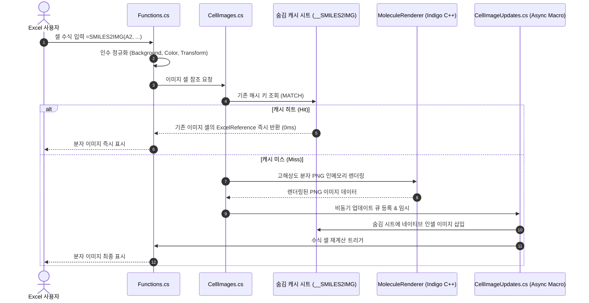

# SMILES2IMG — Excel 분자 구조식 자동 렌더러

[English](README.md) | **한국어**

[-blue.svg)](#사전-요구사항)
[](https://dotnet.microsoft.com/)
[](https://excel-dna.net/)
[](https://lifescience.opensource.epam.com/indigo/)
[](#-빠른-시작-설치-방법)

> **SMILES 화학 구조식 문자열을 Excel 셀 안의 고해상도 인셀(In-Cell) 분자 이미지로 즉시 변환하는 Excel 추가 기능(Add-in)입니다.**  
> 외부 웹 서버나 클라우드 전송 없이, PC 로컬에서 100% 오프라인으로 안전하고 빠르게 렌더링됩니다.

---

## 📑 목차
- [🚀 빠른 시작 (설치 방법)](#-빠른-시작-설치-방법)
- [💡 사용 방법 및 수식 IntelliSense](#-사용-방법-및-수식-intellisense)
- [📖 함수 구문 및 인자 규격](#-함수-구문-및-인자-규격)
- [🎨 주요 활용 레시피 (실전 예시)](#-주요-활용-레시피-실전-예시)
- [🔬 화학 구조 렌더링 최적화 (ACS 저널 표준)](#-화학-구조-렌더링-최적화-acs-저널-표준)
- [🏗️ 내부 아키텍처 및 동작 원리](#️-내부-아키텍처-및-동작-원리)
- [📂 프로젝트 디렉터리 구조](#-프로젝트-디렉터리-구조)
- [🛠️ 빌드 및 배포 방법 (개발자용)](#️-빌드-및-배포-방법-개발자용)
- [🧪 자동화 테스트 및 검증](#-자동화-테스트-및-검증)
- [❓ 자주 묻는 질문 (FAQ)](#-자주-묻는-질문-faq)

---

## 🚀 빠른 시작 (설치 방법)

Windows 데스크톱 Excel(Microsoft 365, Office 2021/2024 등 셀 내 이미지 기능 지원 버전)에서 즉시 사용할 수 있습니다.

### 1단계: 내 Excel 비트수(32비트 vs 64비트) 확인
1. Excel 실행 후 **[파일] → [계정] → [Excel 정보]** 클릭
2. 팝업 창 첫 줄 끝부분에서 **`32비트`** 또는 **`64비트`** 확인

### 2단계: 추가 기능(XLL) 파일 준비
내 Excel 비트수에 맞는 **`.xll` 파일 1개만** 원하는 안전한 위치(예: `C:\ExcelAddIns\` 또는 문서 폴더)에 저장합니다:
* **64비트 Excel:** [`dist/x64/Smiles2Img-AddIn64-packed.xll`](dist/x64/Smiles2Img-AddIn64-packed.xll)
* **32비트 Excel:** [`dist/x86/Smiles2Img-AddIn-packed.xll`](dist/x86/Smiles2Img-AddIn-packed.xll)

> [!TIP]
> **Windows 보안 차단 해제 (최초 1회 권장):**  
> 인터넷이나 GitHub에서 다운로드한 파일의 경우 Windows가 실행을 차단할 수 있습니다.  
> 다운로드한 `.xll` 파일 우클릭 → **[속성]** → 하단 보안 항목의 **[차단 해제(Unblock)]** 체크 후 **[확인]**을 눌러주세요.

> [!NOTE]
> **단일 파일(Single-File) 100% 완전 독립 실행:**  
> EPAM Indigo C++ 네이티브 화학 렌더링 엔진 및 실시간 수식 IntelliSense 라이브러리가 `.xll` 파일 내부에 모두 압축 내장되어 있습니다.  
> 별도의 추가 DLL들을 복사할 필요 없이, **오직 `.xll` 파일 단 1개만** 있으면 즉시 작동합니다.

### 3단계: Excel에 영구 추가 기능으로 등록
1. Excel 메뉴에서 **[파일] → [옵션] → [추가 기능]** 이동
2. 창 하단 **[관리: Excel 추가 기능]** 옆의 **[이동(G)...]** 버튼 클릭
3. **[찾아보기(B)...]**를 눌러 준비한 XLL 파일 선택:
   * 64비트: `Smiles2Img-AddIn64-packed.xll`
   * 32비트: `Smiles2Img-AddIn-packed.xll`
4. 목록에 `Smiles2Img-AddIn`이 체크된 것을 확인하고 **[확인]** 클릭

*(등록을 완료하면 이후 Excel을 실행할 때마다 함수가 자동으로 로드됩니다.)*

---

## 💡 사용 방법 및 수식 IntelliSense

Excel 워크시트의 셀에 `=SMILES2IMG(...)` 수식을 입력하면 즉시 셀 내 분자 이미지가 삽입됩니다.

```excel
=SMILES2IMG(A2)
```

```text
=SMILES2IMG(
┌────────────────────────────────────────────────────────────────────────────────────────┐
│ SMILES2IMG(smiles, [background], [color], [transform])                                 │
│ A SMILES string or a cell reference containing one (e.g., A2, "CCO").                  │
└────────────────────────────────────────────────────────────────────────────────────────┘
```

> [!TIP]
> • **실시간 수식 툴팁 (ExcelDna.IntelliSense 내장):** `=SMILES2IMG(` 를 타이핑하면 엑셀 기본 내장 함수와 동일하게 현재 입력 중인 인자가 **굵은 글씨**로 강조되며 영문 설명 풍선도움말이 표시됩니다.  
> • **가독성 최적화:** 분자 구조의 미세 결합선이 선명하게 보이도록 행 높이(예: 80~120pt)와 열 너비(예: 25~40)를 넉넉하게 늘려주시는 것을 권장합니다.

---

## 📖 함수 구문 및 인자 규격

```excel
=SMILES2IMG(smiles, [background], [color], [transform])
```

| 순서 | 인자명 | 타입 | 필수 여부 | 기본값 | 허용 값 및 세부 설명 |
| :---: | :--- | :---: | :---: | :---: | :--- |
| **1** | **`smiles`** | 문자열 | **필수** | - | 1~2000자의 SMILES 문자열 또는 해당 문자열이 들어있는 셀 참조 (예: `A2`, `"CCO"`) |
| **2** | **`background`** | 문자열 | 선택 | `"white"` | **배경 스타일 설정 (대소문자 무관):**<br>• `"trans"` 또는 `"transparent"`, `"nobg"`: 셀 채우기 색상/표 서식이 그대로 비치는 투명 배경<br>• `"white"`: 흰색 불투명 배경 (기본값)<br>• `"#RRGGBB"`: 16진수 커스텀 배경색 (예: `"#FFFF00"`, `"#FFF8DC"`) |
| **3** | **`color`** | 불리언/숫자 | 선택 | `TRUE` | **원소 색상 모드 (학술 논문/인쇄용):**<br>• `TRUE` 또는 `1`: 산소(빨강), 질소(파랑), 황(황갈색) 등 표준 원소 컬러 (기본값)<br>• `FALSE` 또는 `0`: 흑백(Grayscale) 모드 |
| **4** | **`transform`** | 문자열 | 선택 | `""` | **2D 좌표 기하학적 변환 (대소문자 무관):**<br>• `flip`: 좌우 반전 (교과서/화학 DB 표준 고리 배치로 전환)<br>• `flipy`: 상하 반전<br>• `rot90`, `rot180`, `rot270`: 시계 방향 각도 회전 |

> [!TIP]
> • **중간 인자 생략법:** 앞쪽 인자를 기본값으로 두고 뒤쪽 인자만 지정할 때는 쉼표를 연속(` , , `)으로 입력합니다 (예: `=SMILES2IMG(A2, , , "flip")`).  
> • **스마트 하위 호환성:** 2번째 인자 자리에 실수로 불리언 `FALSE`를 전달하더라도 파서가 자동으로 흑백 모드로 안전하게 인식합니다.

---

## 🎨 주요 활용 레시피 (실전 예시)

| 활용 목적 | 추천 수식 작성 예시 | 설명 |
| :--- | :--- | :--- |
| **기본 컬러 렌더링** | `=SMILES2IMG(A2)` | 셀 참조 전달 (기본 흰 배경 + 표준 컬러) |
| **화학식 직접 입력** | `=SMILES2IMG("CC(=O)Oc1ccccc1C(=O)O")` | 아스피린 구조식 직접 전달 |
| **투명 배경 (표/서식용)** | `=SMILES2IMG(A2, "trans")` | 2번째 인자에 바로 지정 (셀 채우기 색상 투과) |
| **사용자 정의 배경색** | `=SMILES2IMG(A2, "#FFFF00")` | 노란색 등 특정 테마 배경색 지정 |
| **ACS 저널 흑백 표기** | `=SMILES2IMG(A2, , FALSE)` | 3번째 인자에 `FALSE` 지정 (흑백 인쇄용) |
| **투명 배경 + 흑백** | `=SMILES2IMG(A2, "trans", FALSE)` | 배경과 색상 스타일을 나란히 지정 |
| **교과서 배치 좌우 반전** | `=SMILES2IMG(A2, , , "flip")` | 4번째 인자에 `"flip"` (니코틴, 티아민 등 표준 방향 정렬) |
| **투명 + 흑백 + 반전** | `=SMILES2IMG(A2, "trans", FALSE, "flip")` | 모든 옵션 조합 사용 |
| **가로/세로 90도 회전** | `=SMILES2IMG(A2, , , "rot90")` | 긴 사슬형 분자를 셀 종횡비에 맞게 회전 |

---

## 🔬 화학 구조 렌더링 최적화 (ACS 저널 표준)

화학자 및 국제 저널(ACS, IUPAC)이 선호하는 시각적 완성도를 제공하기 위해 다음 최적화 파이프라인이 적용되어 있습니다:


1. **가변 고해상도 벡터급 렌더링 (Dynamic Resolution):**  
   고정 캔버스 크기 대신 결합 길이(Bond Length: 80px), 여백(Margins: 30px), 선 상대 두께(Relative Thickness: 1.5) 기반 가변 해상도를 적용하여 분자 크기와 무관하게 모든 화합물이 균일한 선 굵기와 비율로 렌더링됩니다.
2. **Kekulé 표기법 자동 전환 (`dearomatize`):**  
   벤젠 고리 등의 어색한 점선 원형(Aromatic circle) 대신 유기화학 논문 표준인 교대 이중결합(Kekulé form)으로 명확히 표현합니다 (`aromaticity-model = generic`).
3. **고리 접합부/가교 키랄 수소(H) 선별 보존 (`ExposeRingJunctionChiralHydrogens`):**  
   다환계 접합부(Ring Junction, 예: 아플라톡신, 베르게닌)에서 결합선 겹침을 방지하고 입체 배치를 명확히 하기 위해 접합부 키랄 수소를 선별적으로 보존합니다 (α-투존 등 3원환 내부 결합 왜곡 방지 포함).
4. **헤테로원자 결합 메틸기 및 소형 분자 가독성 개선:**  
   - 초소형 분자(MIC `CN=C=O`, 메탄올 `CO`, 에탄올 등)는 단순 빗금 대신 화학 표준 텍스트(`H₃C-N=C=O`, `H₃C-OH`)로 명시합니다.
   - N/O/S에 결합된 메틸기를 자동 식별하여 `N-CH₃`, `H₃C-O-` 등으로 표기하며, 카로틴 등 순수 탄화수소 사슬은 골격선으로 유지합니다.
5. **스마트 수평 레이아웃 (`smart-layout` + `layout-orientation: horizontal`):**  
   티아민, 니코틴처럼 두 고리가 연결된 구조의 가교 결합을 반듯한 수평으로 정렬하고 가로가 긴 엑셀 셀 종횡비에 최적화합니다.
6. **황(S) 원자 시인성 최적화:**  
   흰 배경에서 눈이 부신 형광 노랑 대신 다크 골든로드/황갈색(`#A88013`)으로 렌더링되어 높은 가독성을 제공합니다.
7. **투명 배경 및 커스텀 배경색 완벽 지원:**  
   알파 채널(Alpha=0) 투명 배경과 16진수 색상 배경을 완벽하게 지원합니다.

---

## 🏗️ 내부 아키텍처 및 동작 원리



- **100% 인메모리 오프라인 실행:** Node.js, WebView2, 외부 HTTP 웹 API 통신 없이 로컬 인메모리 프로세스 안에서 순수하게 처리됩니다.
- **스마트 캐싱 및 시트 무결성:** 워크시트 내 숨겨진 `__SMILES2IMG` 캐시 시트를 통해 이미지를 재사용하므로 파일 저장 후 다시 열어도 이미지가 손실되지 않고 초고속으로 복원됩니다.

---

## 📂 프로젝트 디렉터리 구조

```text
func_SMILES2IMG/
├── dist/                               # 배포용 단일 파일 XLL 산출물
│   ├── x64/
│   │   ├── Smiles2Img-AddIn64-packed.xll   # 64비트 Excel용 완전 독립형 XLL (~8.6 MB)
│   │   └── THIRD_PARTY_NOTICES.md
│   └── x86/
│       ├── Smiles2Img-AddIn-packed.xll     # 32비트 Excel용 완전 독립형 XLL (~8.7 MB)
│       └── THIRD_PARTY_NOTICES.md
├── Rendering/                          # 분자 렌더링 및 네이티브 이미지 처리
│   ├── MoleculeRenderer.cs             # Indigo 렌더링 파이프라인 (ACS 표준 최적화)
│   ├── NativeImageWorkbook.cs          # OpenXML 기반 네이티브 이미지 워크북 지원
│   └── NativeIndigo.cs                 # 임베디드 C++ 네이티브 DLL 런타임 자동 추출기
├── assets/                             # 템플릿 및 리소스
│   └── native-image-template.xlsx
├── Properties/
│   └── AssemblyInfo.cs
├── tests/                              # 자동화 테스트 슈트
│   ├── Excel-Smoke.ps1                 # 실제 Excel COM 프로세스 구동 E2E 테스트
│   ├── Program.cs                      # 헤드리스 단위 테스트 (렌더링 무결성 검증)
│   └── Smiles2Img.Tests.csproj
├── AddIn.cs                            # Excel-DNA 진입점 및 진단 리본 UI
├── CellImages.cs                       # 인셀 이미지 캐시 관리 및 ExcelReference 바인딩
├── CellImageUpdates.cs                 # 비동기 이미지 삽입 매크로 큐
├── Functions.cs                        # =SMILES2IMG 수식 정의 및 IntelliSense 메타데이터
├── Smiles2Img-AddIn.dna                # Excel-DNA 구성 선언 파일
├── Smiles2Img.csproj                   # MSBuild 프로젝트 파일
├── THIRD_PARTY_NOTICES.md              # 오픈소스 라이선스 고지문
├── PLAN.md                             # 상세 설계 및 개선 로드맵 문서
├── README.KR.md                        # 한국어 가이드 문서
└── README.md                           # 영문 기본 가이드 문서
```

---

## 🛠️ 빌드 및 배포 방법 (개발자용)

### 사전 요구사항
* Windows 10/11
* [.NET SDK 8.0 이상](https://dotnet.microsoft.com/) (.NET Framework 4.8 타깃 빌드)

### 빌드 명령어
프로젝트 루트 디렉터리에서 아래 명령어를 실행합니다:

```powershell
# 패키지 복원
dotnet restore --tl:off

# 릴리스 빌드 및 단일 파일 XLL 패킹
dotnet build -c Release --no-restore --tl:off
```

빌드가 성공하면 `dist/x64/` 및 `dist/x86/`에 모든 C++ 네이티브 라이브러리와 IntelliSense가 압축 내장된 단일 `.xll` 파일이 생성됩니다.

---

## 🧪 자동화 테스트 및 검증

### 1. 헤드리스 단위 테스트 (Excel 불필요)
화학 구조 렌더링, 수소 보존, 변환 매개변수, 투명 배경 픽셀 유효성을 헤드리스 콘솔에서 검증합니다:

```powershell
dotnet build tests/Smiles2Img.Tests.csproj -c Release --no-restore --tl:off
& tests/bin/Release/net48/Smiles2Img.Tests.exe
```

### 2. Excel COM E2E 자동화 스모크 테스트 (실제 Excel 구동)
실제 Excel 인스턴스를 백그라운드로 띄워 전체 라이프사이클을 검증합니다:

```powershell
powershell -NoProfile -STA -ExecutionPolicy Bypass -File tests/Excel-Smoke.ps1
```
* XLL 추가 기능 등록 및 수식 인식 검증
* 인셀 이미지 자동 삽입 및 수식 유지 검증
* SMILES 수정 시 이미지 실시간 갱신 (중복/떠다니는 이미지 없음)
* 캐시 히트를 통한 즉각적인 다른 셀 재사용 검증
* 통합문서 저장, 재오픈 후 이미지 유지 검증
* 수식 셀 삭제 시 캐시 이미지 자동 정리 검증

---

## ❓ 자주 묻는 질문 (FAQ)

* **Q. 수식 결과가 `#VALUE!`로 나옵니다.**
  * 참조한 셀에 올바른 SMILES 문자열이 들어있는지 확인하세요.
  * 수식이 참조하는 셀에 **셀 병합(Merged Cells)**이 되어 있으면 빈 셀을 참조하여 `#VALUE!`가 발생할 수 있습니다.
* **Q. Excel에서 XLL 추가 기능이 차단되거나 로드되지 않습니다.**
  * 다운로드한 `.xll` 파일을 우클릭하여 **[속성]** 창 하단의 **[차단 해제(Unblock)]**에 체크한 후 다시 추가해 보세요.
* **Q. 셀 이미지가 너무 작거나 축소되어 보입니다.**
  * 생성된 이미지는 엑셀 셀 크기에 맞춰 자동으로 종횡비가 유지되며 축척됩니다. 행 높이(예: 100pt)와 열 너비(예: 30)를 늘려주시면 큰 이미지로 선명하게 표시됩니다.
* **Q. 상세 로그나 진단 정보를 확인하고 싶습니다.**
  * Excel 상단 리본 메뉴의 **[SMILES] → [Show diagnostics]** 창을 열면 실시간 렌더링 로그와 캐시 상태를 확인할 수 있습니다.
