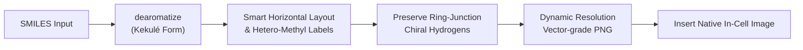
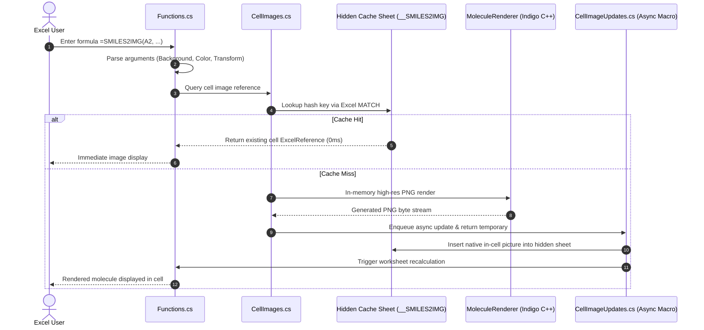

# SMILES2IMG — Automatic Molecular Structure Renderer for Excel

**English** | [한국어](README.KR.md)

[-blue.svg)](#runtime-requirements)
[](https://dotnet.microsoft.com/)
[](https://excel-dna.net/)
[](https://lifescience.opensource.epam.com/indigo/)
[](#-quick-start-installation)

> **An Excel Add-in that instantly converts SMILES chemical structure strings into crisp, in-cell molecular images.**  
> 100% local and offline execution without external web requests, cloud services, or browser runtimes.

<p align="center">
  
</p>

---

## 📑 Table of Contents
- [🚀 Quick Start (Installation)](#-quick-start-installation)
- [💡 Usage & Real-Time IntelliSense](#-usage--real-time-intellisense)
- [📖 Function Syntax & Parameter Specification](#-function-syntax--parameter-specification)
- [🎨 Practical Recipes & Examples](#-practical-recipes--examples)
- [🔬 Chemical Structure Rendering Optimizations (ACS Standards)](#-chemical-structure-rendering-optimizations-acs-standards)
- [🏗️ Architecture & Internal Lifecycle](#️-architecture--internal-lifecycle)
- [📂 Project Directory Structure](#-project-directory-structure)
- [🛠️ Building & Distribution (For Developers)](#️-building--distribution-for-developers)
- [🧪 Automated Testing & Verification](#-automated-testing--verification)
- [❓ Frequently Asked Questions (FAQ)](#-frequently-asked-questions-faq)

---

## 🚀 Quick Start (Installation)

### Runtime requirements

| Component | Requirement |
| :--- | :--- |
| Windows | Windows 10 or 11; Windows 11 recommended |
| Excel (In-Cell Image mode) | **Excel 2024 or later** & **Microsoft 365 Desktop** with native 'Place in Cell' (`=SMILES2IMG`) |
| Excel (Floating Shape mode) | **Excel 2016, 2019, 2021** with cell-anchored shape support (`=SMILES2IMG.FLOAT`) |
| Runtime | **.NET Framework 4.8 or later** |
| Excel architecture | Both **32-bit and 64-bit** packages are provided; choose the XLL matching Excel's bitness |

**A single XLL package supports Excel 2016 through the latest Microsoft 365:**
* **Excel 2024 / Microsoft 365:** Use `=SMILES2IMG(A2)` for native in-cell images that live directly inside worksheet cells.
* **Excel 2016 / 2019 / 2021:** Use `=SMILES2IMG.FLOAT(A2)` for floating molecular pictures that automatically move and resize with their cells (`xlMoveAndSize`). If `=SMILES2IMG` is inadvertently called on an older Excel build, it cleanly displays `Needs Excel 2024/365: use SMILES2IMG.FLOAT` instead of cryptic error codes.
* The add-in runs only in Windows desktop Excel; Excel for Mac and Excel for the web cannot load this XLL. The **.NET SDK is needed only for development/building**, not for using the downloaded XLL.

### ⚡ Method A: One-Click Automatic Installer & Updater (Recommended)

Open PowerShell and run this **single command** to install, register, or update everything automatically:

```powershell
irm https://raw.githubusercontent.com/naramdash/func_SMILES2IMG/main/install.ps1 | iex
```

> **What the installer automates:**  
> 1. Detects your Excel architecture (32-bit vs. 64-bit)  
> 2. Downloads and updates the latest `.xll` in the official `%APPDATA%\Microsoft\AddIns` directory  
> 3. Unblocks the file (`Unblock-File`) to remove Windows security flags  
> 4. Registers the add-in in Excel options for persistent auto-loading  
> 💡 **Future Updates:** Running this exact command again in the future automatically upgrades SMILES2IMG to the latest release!  
> 🗑️ **Uninstallation:** To uninstall anytime, simply run `.\uninstall.ps1` from the repository.

> [!IMPORTANT]
> **Windows 11「Smart App Control (스마트 앱 컨트롤)」Notice**  
> If Excel displays `#NAME?` or warns that `'The file format and extension of Smiles2Img-AddIn64-packed.xll do not match'`, Windows 11 **Smart App Control (스마트 앱 컨트롤)** has blocked the unsigned XLL add-in.  
> 👉 The file is NOT corrupted. Follow the instructions in the **[FAQ section](#-frequently-asked-questions-faq)** to set **Smart App Control** to **'Off'**. (Real-time Microsoft Defender Antivirus protection remains 100% active).

---

### 🖐️ Method B: Manual Step-by-Step Installation

#### Step 1: Check your Excel bitness (32-bit vs. 64-bit)
1. In Excel, go to **[File] → [Account] → [About Excel]**.
2. Note whether the first line indicates **`32-bit`** or **`64-bit`**.

#### Step 2: Prepare the Add-in (.xll) file
Download the single `.xll` file matching your Excel bitness from the [GitHub Releases](https://github.com/naramdash/func_SMILES2IMG/releases/latest) page (recommended location: `Win+R` ➔ `%APPDATA%\Microsoft\AddIns`):
* **64-bit Excel:** [**`Smiles2Img-AddIn64-packed.xll`** (Latest v1.2.0 Download)](https://github.com/naramdash/func_SMILES2IMG/releases/latest/download/Smiles2Img-AddIn64-packed.xll)
* **32-bit Excel:** [**`Smiles2Img-AddIn-packed.xll`** (Latest v1.2.0 Download)](https://github.com/naramdash/func_SMILES2IMG/releases/latest/download/Smiles2Img-AddIn-packed.xll)

> [!TIP]
> **Unblock downloaded file (Essential):**  
> Web downloads receive an NTFS `Mark of the Web` tag, which causes Excel to block the add-in.  
> Right-click the downloaded `.xll` file → select **Properties** → check **Unblock** at the bottom of the General tab → click **OK**.

#### Step 3: Register as an Excel Add-in
1. In Excel, go to **[File] → [Options] → [Add-ins]**.
2. At the bottom, ensure **Manage: [Excel Add-ins]** is selected and click **[Go...]**.
3. Click **[Browse...]** and select your downloaded XLL file.
4. Verify that `Smiles2Img-AddIn` is checked in the list and click **[OK]**.

*(Once registered, the `=SMILES2IMG` function will automatically load every time Excel starts.)*

---

## 💡 Usage & Real-Time IntelliSense
 
Type formula in any worksheet cell to insert a molecular rendering:
* **Excel 2024 / M365:** `=SMILES2IMG(A2)` (In-cell native image)
* **Excel 2016 / 2019 / 2021:** `=SMILES2IMG.FLOAT(A2)` (Cell-anchored floating picture)
 
```excel
=SMILES2IMG(A2)
=SMILES2IMG.FLOAT(A2)
```
 
```text
=SMILES2IMG(
┌────────────────────────────────────────────────────────────────────────────────────────┐
│ SMILES2IMG(smiles, [background], [style], [transform])                                 │
│ [Excel 2024 / Microsoft 365] Renders a high-resolution molecular structure image...   │
└────────────────────────────────────────────────────────────────────────────────────────┘

=SMILES2IMG.FLOAT(
┌────────────────────────────────────────────────────────────────────────────────────────┐
│ SMILES2IMG.FLOAT(smiles, [background], [style], [transform])                           │
│ [Excel 2016+] Places a molecular structure picture over the cell (moves/sizes)...      │
└────────────────────────────────────────────────────────────────────────────────────────┘
```
 
> [!TIP]
> • **Real-time formula tooltips (ExcelDna.IntelliSense):** As you type `=SMILES2IMG(` or `=SMILES2IMG.FLOAT(`, Excel displays native-style tooltips highlighting the active argument in bold with clear English descriptions.  
> • **Row/Column resizing (FLOAT mode):** Pictures placed by `SMILES2IMG.FLOAT` move and stretch with cell rows and columns (`xlMoveAndSize`). If row heights or column widths are manually altered and you wish to cleanly restore their exact aspect ratios, click **[SMILES] → [Refit floating images]** on the ribbon menu.  
> • **Cell sizing:** For optimal bond resolution and readability, increase the row height (e.g., 80–120 pt) and column width (e.g., 25–40).
 
---
 
## 📖 Function Syntax & Parameter Specification
 
```excel
=SMILES2IMG(smiles, [background], [style], [transform])
=SMILES2IMG.FLOAT(smiles, [background], [style], [transform])
```
 
*(Both functions accept identical parameters and default values.)*

| Order | Argument | Type | Required | Default | Allowed Values & Description |
| :---: | :--- | :---: | :---: | :---: | :--- |
| **1** | **`smiles`** | String | **Required** | - | A valid SMILES string (1–2000 chars) or a cell reference (e.g., `A2`, `"CCO"`). |
| **2** | **`background`** | String | Optional | `"trans"` | **Background canvas styling (case-insensitive):**<br>• `"trans"`, `"transparent"`, `"nobg"`: Transparent canvas (default, blends with cell fills & zebra tables)<br>• `"white"`: Opaque white canvas background<br>• CSS color names: `"yellow"`, `"lightblue"`, `"lightgray"`, `"aliceblue"`, `"cornsilk"`, `"pink"`, etc. (140+ CSS names)<br>• Hex colors: `"#FFFF00"` or `"FFFF00"` (3- or 6-digit hex) |
| **3** | **`style`** | String / Bool | Optional | `"color"` | **Chemical rendering style & domain options (combinable with spaces or pipes `|`):**<br>• **Single Style Tokens:**<br>  - Standard CPK colors: `"color"`, `"cpk"`, `TRUE`, `1` *(default: Oxygen=red, Nitrogen=blue, Sulfur=gold)*<br>  - Monochrome line art: `"bw"`, `"mono"`, `"black"`, `FALSE`, `0` *(patent line art & ACS journal print)*<br>  - Atom numbering: `"num"`, `"idx"`, `"number"` *(sequential 1, 2, 3... indices for NMR peaks & mechanisms)*<br>  - Stereochemistry labels: `"stereo"`, `"chiral"`, `"ext"` *(explicit R/S and E/Z annotations)*<br>  - Explicit hydrogens: `"h"`, `"hydrogens"`, `"unfoldh"` *(unfolds and draws all C-H bonds)*<br>  - Skeletal carbon letters: `"all-c"`, `"carbon"` *(explicit "C" text on every backbone vertex)*<br>  - Dark mode white ink: `"white"`, `"light"` *(crisp pure-white lines on dark presentation sheets)*<br>  - Custom ink color: `"ink=#RRGGBB"`, `"ink=navy"` *(brand/corporate theme line color)*<br>• **String Combination Examples (using spaces or pipes `|`):**<br>  - Patent numbered drawings: `"bw num"` *(or `"bw|num"`)*<br>  - Journal monochrome chiral: `"bw stereo"` *(or `"bw|stereo"`)*<br>  - Reaction mechanism tracking: `"num h"` *(or `"num|h"`)*<br>  - Dark mode chiral structure: `"white stereo"` *(or `"white|stereo"`)*<br>  - Dark mode full composite: `"white stereo num h"`<br>• **⭐ Ultimate Full-Option String Example (All Style Capabilities Active):**<br>  - `"bw num stereo h all-c"`<br>  - *(or with pipe delimiters: `"bw|num|stereo|h|all-c"`)* |
| **4** | **`transform`** | String | Optional | `""` | **2D coordinate transforms (case-insensitive, combinable with spaces):**<br>• `flip`: Horizontal flip (matches textbook/reference ring orientation)<br>• `flipy`: Vertical flip<br>• `rot90`, `rot180`, `rot270`: Clockwise rotation by 90-degree increments<br>• **Composite chaining examples:** `"flip rot90"` (flipped horizontally and rotated 90°), `"rot180"` |

> [!TIP]
> • **The Ultimate "Full-Option" Formula (All Features Active):**  
>   `=SMILES2IMG(A2, "white", "bw num stereo h all-c", "flip rot90")`  
>   *(or with pipe delimiters: `=SMILES2IMG(A2, "white", "bw|num|stereo|h|all-c", "flip rot90")`)*  
>   Combines every single capability: opaque white canvas, 100% monochrome lines, sequential atom indices (1, 2, 3...), stereochemical (R/S) centers, fully unfolded hydrogens, explicit "C" backbone atoms, horizontal textbook flip, and a 90° clockwise rotation!  
> • **Spaces vs. Pipes (Style Separation):** Combine multiple styles using **spaces** (`"bw num"`, `"white stereo"`) or **pipes** (`"bw|num"`, `"white|stereo"`). Both prevent visual confusion with Excel's argument commas. (Commas `"bw,num"` also supported).  
> • **Skipping Preceding Optional Arguments:** To keep preceding arguments at their defaults (transparent canvas) while specifying later ones, simply leave them empty with commas (e.g., `=SMILES2IMG(A2, , "bw")` or `=SMILES2IMG(A2, , , "flip")`).  
> • **Full Backward Compatibility:** Passing booleans (`TRUE`/`FALSE`) or numeric values (`1`/`0`) as the 3rd argument (or as the 2nd argument fallback) remains 100% supported.

---

## 🎨 Practical Recipes & Examples

<p align="center">
  
</p>

| Category | Goal / Scenario | Example Formula | Description |
| :--- | :--- | :--- | :--- |
| **⭐ All-in-One** | **Ultimate Full-Option Formula** | `=SMILES2IMG(A2, "white", "bw num stereo h all-c", "flip rot90")` | All parameters combined: White canvas + B/W + Atom numbering + Chiral labels + Unfolded hydrogens + Explicit carbons + Flipped + 90° rotation |
| **⭐ All-in-One** | **Full-Option Dark Mode** | `=SMILES2IMG(A2, "#1a1a1a", "white stereo num h", "flip")` | Dark canvas + Pure-white bonds + Chiral labels + Atom numbering + Unfolded hydrogens + Flipped |
| **Basic** | **Cell Reference** | `=SMILES2IMG(A2)` | Standard transparent canvas + full CPK elemental colors |
| **Basic** | **Direct Inline SMILES** | `=SMILES2IMG("CC(=O)Oc1ccccc1C(=O)O")` | Directly renders aspirin structure without referencing external cells |
| **Patent & Journal** | **Patent Line Art (B/W)** | `=SMILES2IMG(A2, , "bw")` | 100% black & white monochrome line art for patent (KIPO/USPTO) submissions |
| **Patent & Journal** | **Patent Drawing with Numbers** | `=SMILES2IMG(A2, , "bw num")` | Numbered atoms (1, 2, 3...) on clean monochrome lines for patent claim drafting |
| **Patent & Journal** | **Journal Stereochemical Figure** | `=SMILES2IMG(A2, , "bw stereo")` | B/W journal printing style with explicit R/S and E/Z stereochemical annotations |
| **Patent & Journal** | **Complete Patent Specification** | `=SMILES2IMG(A2, "white", "bw num stereo")` | Opaque white canvas + B/W + atom numbering + chiral labels |
| **Spectroscopy & Mechanism** | **NMR Peak Assignment** | `=SMILES2IMG(A2, , "num")` | Displays atom index numbers (1, 2, 3...) to correlate with ¹H/¹³C NMR spectra |
| **Spectroscopy & Mechanism** | **Chiral Centers & Absolute Config** | `=SMILES2IMG(A2, , "stereo")` | Annotates asymmetric carbon centers and double-bond geometry |
| **Spectroscopy & Mechanism** | **Steric Hindrance / Proton Exchange** | `=SMILES2IMG(A2, , "h")` | Unfolds and displays all C-H hydrogen bonds to inspect crowding and reactive sites |
| **Spectroscopy & Mechanism** | **Reaction Mechanism Tracking** | `=SMILES2IMG(A2, , "num h")` | Combines atom indexing and explicit hydrogens for curly-arrow electron tracking |
| **Education & Structural Clarity** | **All Skeletal Carbons Marked** | `=SMILES2IMG(A2, , "all-c")` | Displays literal "C" text on every carbon vertex (ideal for introductory organic chemistry) |
| **Education & Structural Clarity** | **All Carbons + Atom Numbering** | `=SMILES2IMG(A2, , "all-c num")` | Full skeletal carbon labeling paired with sequential atom indices |
| **Dark Theme & UI Styling** | **Dark Sheet Presentation** | `=SMILES2IMG(A2, "#1e1e1e", "white")` | Deep gray cell canvas with crisp, pure-white molecular bonds |
| **Dark Theme & UI Styling** | **Dark Mode with Chiral Labels** | `=SMILES2IMG(A2, "#202020", "white stereo")` | Modern dark background + white molecular bonds + R/S stereochemical labels |
| **Dark Theme & UI Styling** | **Corporate / Brand Ink Color** | `=SMILES2IMG(A2, "aliceblue", "ink=#003366")` | Custom navy blue line ink on light blue canvas |
| **Dark Theme & UI Styling** | **Highlighted Hazard Cell** | `=SMILES2IMG(A2, "#FFF9C4", "bw num")` | Pastel yellow alert cell fill with monochrome numbered molecule |
| **Orientation & Alignment** | **Textbook Orientation (Flip)** | `=SMILES2IMG(A2, , , "flip")` | Horizontally flips rings (e.g., nicotine, thiamine) to match textbook figures |
| **Orientation & Alignment** | **Vertical Flip** | `=SMILES2IMG(A2, , , "flipy")` | Flips molecular coordinates vertically |
| **Orientation & Alignment** | **Rotate Long Chains 90°** | `=SMILES2IMG(A2, , , "rot90")` | Rotates elongated linear chains by 90° to fit narrow vertical table columns |
| **Orientation & Alignment** | **Rotate 180°** | `=SMILES2IMG(A2, , , "rot180")` | Inverts molecule upside-down |
| **Multi-Combination** | **White Bg + B/W + Flipped** | `=SMILES2IMG(A2, "white", "bw", "flip")` | Clean white canvas + monochrome ink + horizontal flip |
| **Excel 2016/2019/2021 Mode** | **Floating Shape (Legacy Excel)** | `=SMILES2IMG.FLOAT(A2)` | Cell-anchored floating shape (`xlMoveAndSize`) on Excel 2016, 2019, 2021 |
| **Excel 2016/2019/2021 Mode** | **Floating Patent Drawing** | `=SMILES2IMG.FLOAT(A2, , "bw num")` | Floating picture mode with patent monochrome numbering |
| **Excel 2016/2019/2021 Mode** | **Floating Dark Mode** | `=SMILES2IMG.FLOAT(A2, "#1e1e1e", "white stereo")` | Floating picture mode with dark background and white bonds |

---

## 🔬 Chemical Structure Rendering Optimizations (ACS Standards)

To satisfy the aesthetic and clarity standards of academic chemistry publications (ACS, IUPAC), the following automated enhancements are applied:



1. **Dynamic Resolution & Vector-Grade Scaling:**  
   Replaces rigid canvas constraints with dynamic dimensioning based on bond length (80 px), margins (30 px), and relative bond thickness (1.5). Large macromolecular structures and simple diatomics maintain proportional bond weights and consistent label sizes.
2. **Kekulé Form Normalization (`dearomatize`):**  
   Converts ambiguous circular aromatic notations into crisp alternating double bonds preferred by organic chemists (`aromaticity-model = generic`).
3. **Selective Ring-Junction Chiral Hydrogen Preservation:**  
   While standard skeletal formulas hide carbon-bound hydrogens, bridgehead and ring-junction stereocenters (e.g., aflatoxin, bergenin) retain explicit wedge/dash hydrogens to prevent visual ambiguity and bond overlaps.
4. **Heteroatom-Bound Methyl Groups & Small-Molecule Readability:**  
   - Ultra-small molecules ($\le$ 4 heavy atoms, e.g., methyl isocyanate `CN=C=O`, methanol `CO`, ethanol) automatically render explicit text formulas (`H₃C-N=C=O`, `H₃C-OH`).
   - Heteroatom-bound methyls (e.g., in nicotine, caffeine, pyrethrins) display explicit labels (`N-CH₃`, `H₃C-O-`), while aliphatic hydrocarbon backbones remain sleek skeletal lines.
5. **Smart Horizontal Layout (`smart-layout` + `layout-orientation: horizontal`):**  
   Aliphatic bridges between rings (such as in thiamine and nicotine) are leveled horizontally, perfectly complementing standard rectangular spreadsheet cells.
6. **Optimized Sulfur (S) Visibility:**  
   Rendered in dark goldenrod (`#A88013`) instead of glaring yellow (`#FFFF00`) for clear contrast on white backgrounds.
7. **Alpha-Channel Transparency & Hex Colors:**  
   Supports true 32-bit alpha transparency (`Alpha=0`) and custom hex color fills.

---

## 🏗️ Architecture & Internal Lifecycle



- **100% In-Memory Offline Execution:** Eliminates external network calls, Node.js processes, or embedded browser frameworks.
- **Cache Persistence & Workbook Portability:** Images are cached in an internal hidden sheet (`__SMILES2IMG`), ensuring instant restoration when workbooks are saved and reopened.

---

## 📂 Project Directory Structure

```text
func_SMILES2IMG/
├── dist/                               # Standalone packed XLL distribution artifacts
│   ├── x64/
│   │   ├── Smiles2Img-AddIn64-packed.xll   # 64-bit self-contained Excel Add-in (~8.6 MB)
│   │   └── THIRD_PARTY_NOTICES.md
│   └── x86/
│       ├── Smiles2Img-AddIn-packed.xll     # 32-bit self-contained Excel Add-in (~8.7 MB)
│       └── THIRD_PARTY_NOTICES.md
├── Rendering/                          # Chemistry rendering & image pipeline
│   ├── MoleculeRenderer.cs             # Indigo rendering logic & ACS optimizations
│   ├── RenderOptions.cs                # Render option model & formula argument parser
│   ├── ColorHelper.cs                  # Color normalization & Hex/RGB converter
│   ├── NativeImageWorkbook.cs          # OpenXML native image workbook support
│   └── NativeIndigo.cs                 # Embedded unmanaged C++ DLL extraction loader
├── assets/                             # Workbook templates & static resources
│   └── native-image-template.xlsx
├── Properties/
│   └── AssemblyInfo.cs
├── tests/                              # Automated test suites
│   ├── Excel-Smoke.ps1                 # Full COM automation E2E smoke tests
│   ├── Excel-365-FeatureTests.ps1      # Live Excel 365 new styles & full-option tests
│   ├── Excel-DeepStressTests.ps1       # 20-molecule bulk rendering & edge-case stress test
│   ├── Program.cs                      # Headless unit test runner
│   └── Smiles2Img.Tests.csproj
├── AddIn.cs                            # Excel-DNA initialization & diagnostic ribbon UI
├── CellImages.cs                       # In-cell image cache & ExcelReference bindings
├── CellImageUpdates.cs                 # Asynchronous image insertion macro queue
├── Functions.cs                        # =SMILES2IMG UDF & IntelliSense definitions
├── FloatFunctions.cs                   # =SMILES2IMG.FLOAT legacy floating UDF definitions
├── FloatingPictures.cs                 # Cell-anchored floating shape manager (xlMoveAndSize)
├── FloatingPictureUpdates.cs           # Floating picture batch update queue
├── Smiles2Img-AddIn.dna                # Excel-DNA manifest configuration
├── Smiles2Img.csproj                   # MSBuild project file (.NET 4.8)
├── THIRD_PARTY_NOTICES.md              # Open-source license acknowledgments
├── PLAN.md                             # Architectural roadmap & optimization log
├── README.KR.md                        # Korean documentation
└── README.md                           # Main English documentation (this file)
```

---

## 🛠️ Building & Distribution (For Developers)

### Prerequisites
* Windows 10/11
* [.NET SDK 8.0 or newer](https://dotnet.microsoft.com/) (targeting .NET Framework 4.8)

### Build Commands
Run from the repository root:

```powershell
# Restore dependencies
dotnet restore --tl:off

# Build Release and pack standalone XLLs
dotnet build -c Release --no-restore --tl:off
```

The resulting packed XLLs in `dist/x64/` and `dist/x86/` contain all dependencies (ExcelDna, IntelliSense, Indigo C++ runtimes) within a single self-extracting archive.

---

## 🧪 Automated Testing & Verification

### 1. Headless Unit Tests (Excel not required)
Verifies molecule rendering, chiral hydrogen retention, transforms, and alpha transparency in headless console mode:

```powershell
dotnet build tests/Smiles2Img.Tests.csproj -c Release --no-restore --tl:off
& tests/bin/Release/net48/Smiles2Img.Tests.exe
```

### 2. Excel COM E2E Automation Smoke Tests (Runs live Excel)
Automates an actual background Excel instance to test full lifecycle reliability:

```powershell
powershell -NoProfile -STA -ExecutionPolicy Bypass -File tests/Excel-Smoke.ps1
```
* XLL registration and formula discovery
* In-cell picture embedding and formula persistence
* Real-time image replacement upon SMILES modification (zero floating shapes)
* Cache hit instantaneous reuse across multiple cells
* Workbook saving, reopening, and cache restoration
* Automatic orphaned cache cleanup when formulas are deleted

### 3. Excel 365 Real-World Feature & Bulk Stress Tests
Validates modern delimiters, ultimate full-option formulas, and 20+ concurrent complex molecules:

```powershell
# Live Excel 365 feature & full-option suite
powershell -NoProfile -STA -ExecutionPolicy Bypass -File tests/Excel-365-FeatureTests.ps1

# 20-molecule bulk rendering & stress suite
powershell -NoProfile -STA -ExecutionPolicy Bypass -File tests/Excel-DeepStressTests.ps1
```

---

## ❓ Frequently Asked Questions (FAQ)

* **Q. Which function should I use for my Excel version?**
  * **Microsoft 365 or Excel 2024+:** Use `=SMILES2IMG(...)` for native in-cell images that sit snugly inside cells.
  * **Excel 2016, 2019, 2021:** Use `=SMILES2IMG.FLOAT(...)` because older Excel builds lack in-cell images. Images float over cells while perfectly sizing and moving with cells (`xlMoveAndSize`). If `SMILES2IMG` is invoked on older Excel, it safely returns `Needs Excel 2024/365: use SMILES2IMG.FLOAT`.
* **Q. The formula returns `#VALUE!`. How do I know why my chemical formula failed?**
  * Check that the referenced cell contains a valid SMILES string.
  * If the target cell is part of **merged cells**, Excel formulas may point to an empty sub-cell, triggering `#VALUE!`.
  * **💡 Inspect Exact Chemical Errors:** From the Excel ribbon, click **[SMILES] ➔ [Show diagnostics]**. The log window displays the exact error reported by the chemical parser (e.g. unclosed ring cycles `cycle not closed`, invalid valences, or unrecognized atoms) and its exact position!
* **Q. Excel blocks or refuses to load the XLL.**
  * Web downloads receive a Windows `Mark of the Web` security block. Right-click the `.xll` file, open **Properties**, check **Unblock** at the bottom, and click **OK**.
  * Alternatively, run the **one-line automated install script (Method A)** at the top of this guide; it handles unblocking and registry registration automatically.
* **Q. [Smart App Control] Excel displays "The file format and extension do not match" warning or formulas evaluate to `#NAME?`.**
  * **Cause:** The file is NOT corrupted! Windows 11 **Smart App Control (스마트 앱 컨트롤)** blocks unsigned open-source XLL add-in binaries on enforcement mode.
  * **Rest assured:** Disabling Smart App Control does **NOT** disable your antivirus; **real-time Microsoft Defender Antivirus protection remains 100% active**.
  * **Solution (10 seconds):**
    1. Open Windows **Settings** (`Win + I`) ➔ **Privacy & security** ➔ **Windows Security**.
    2. Click **App & browser control** ➔ **Smart App Control settings**.
    3. Change the setting to **'Off'** and restart Excel. The add-in will load and functions will work immediately.
* **Q. The molecular image looks too small or shrunk.**
  * Images scale automatically to preserve aspect ratios within cells. Increase the cell's row height (e.g., 80–120 pt) and column width (e.g., 25–40) for larger, high-contrast renderings.
* **Q. How do I match monochrome journals or dark mode themes?**
  * Pass `"bw"` as the 3rd argument for 100% monochrome patent and ACS print line art.
  * For dark mode sheets, pass a dark background (`"#1a1a1a"`) as the 2nd argument and white ink (`"white"`) as the 3rd argument (e.g., `=SMILES2IMG(A2, "#1a1a1a", "white")`).
