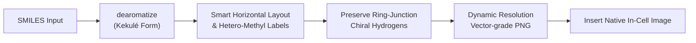
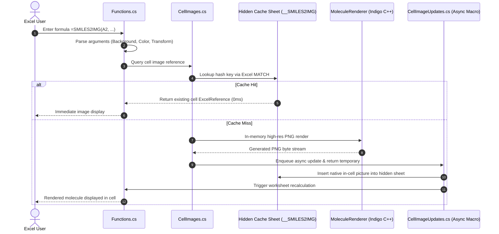

# SMILES2IMG — Automatic Molecular Structure Renderer for Excel

**English** | [한국어](README.KR.md)

[-blue.svg)](#prerequisites)
[](https://dotnet.microsoft.com/)
[](https://excel-dna.net/)
[](https://lifescience.opensource.epam.com/indigo/)
[](#-quick-start-installation)

> **An Excel Add-in that instantly converts SMILES chemical structure strings into crisp, in-cell molecular images.**  
> 100% local and offline execution without external web requests, cloud services, or browser runtimes.

---

## 📑 Table of Contents
- [🚀 Quick Start (Installation)](#-quick-start-installation)
- [💡 Usage & Real-Time IntelliSense](#-usage--real-time-intellisense)
- [📖 Function Syntax & Parameter Specification](#-function-syntax--parameter-specification)
- [🎨 Practical Recipes & Examples](#-practical-recipes--examples)
- [🔬 Chemical Structure Rendering Optimizations (ACS Standards)](#-chemical-structure-rendering-optimizations-acs-standards)
- [🏗️ Architecture & Internal Lifecycle](#️-architecture--internal-lifecycle)
- [📂 Project Directory Structure](#-project-directory-structure)
- [🛠️ Building & Distribution (For Developers)](#️-building--distribution-for-developers)
- [🧪 Automated Testing & Verification](#-automated-testing--verification)
- [❓ Frequently Asked Questions (FAQ)](#-frequently-asked-questions-faq)

---

## 🚀 Quick Start (Installation)

Supported on desktop Windows Excel versions featuring modern in-cell image capabilities (Microsoft 365, Office 2021/2024).

### Step 1: Check your Excel bitness (32-bit vs. 64-bit)
1. In Excel, go to **[File] → [Account] → [About Excel]**.
2. Note whether the first line indicates **`32-bit`** or **`64-bit`**.

### Step 2: Prepare the Add-in (.xll) file
Download the single `.xll` file matching your Excel bitness from the [GitHub Releases](https://github.com/naramdash/func_SMILES2IMG/releases/latest) page (or use the prebuilt files in `dist/`):
* **64-bit Excel:** [**`Smiles2Img-AddIn64-packed.xll`** (v1.0.0 Download)](https://github.com/naramdash/func_SMILES2IMG/releases/download/v1.0.0/Smiles2Img-AddIn64-packed.xll)
* **32-bit Excel:** [**`Smiles2Img-AddIn-packed.xll`** (v1.0.0 Download)](https://github.com/naramdash/func_SMILES2IMG/releases/download/v1.0.0/Smiles2Img-AddIn-packed.xll)

> [!TIP]
> **Unblock downloaded file (Recommended):**  
> If downloaded via browser or git archive, Windows may flag the file with a security block.  
> Right-click the downloaded `.xll` file → select **Properties** → check **Unblock** at the bottom of the General tab → click **OK**.

> [!NOTE]
> **100% Self-Contained Single-File:**  
> The EPAM Indigo C++ native rendering engine and ExcelDna.IntelliSense library are fully embedded inside the packed `.xll`.  
> No external DLLs are required alongside the add-in. On initial execution, native binaries are extracted once to `%LOCALAPPDATA%\Smiles2Img\native\`.

### Step 3: Register as an Excel Add-in
1. In Excel, go to **[File] → [Options] → [Add-ins]**.
2. At the bottom, ensure **Manage: [Excel Add-ins]** is selected and click **[Go...]**.
3. Click **[Browse...]** and select your downloaded XLL file:
   * 64-bit: `Smiles2Img-AddIn64-packed.xll`
   * 32-bit: `Smiles2Img-AddIn-packed.xll`
4. Verify that `Smiles2Img-AddIn` is checked in the list and click **[OK]**.

*(Once registered, the `=SMILES2IMG` function will automatically load every time Excel starts.)*

---

## 💡 Usage & Real-Time IntelliSense

Type `=SMILES2IMG(...)` in any worksheet cell to insert an in-cell molecular rendering:

```excel
=SMILES2IMG(A2)
```

```text
=SMILES2IMG(
┌────────────────────────────────────────────────────────────────────────────────────────┐
│ SMILES2IMG(smiles, [background], [color], [transform])                                 │
│ A SMILES string or a cell reference containing one (e.g., A2, "CCO").                  │
└────────────────────────────────────────────────────────────────────────────────────────┘
```

> [!TIP]
> • **Real-time formula tooltips (ExcelDna.IntelliSense):** As you type `=SMILES2IMG(`, Excel displays native-style tooltips highlighting the active argument in bold with clear English descriptions.  
> • **Cell sizing:** For optimal bond resolution and readability, increase the row height (e.g., 80–120 pt) and column width (e.g., 25–40).

---

## 📖 Function Syntax & Parameter Specification

```excel
=SMILES2IMG(smiles, [background], [color], [transform])
```

| Order | Argument | Type | Required | Default | Allowed Values & Description |
| :---: | :--- | :---: | :---: | :---: | :--- |
| **1** | **`smiles`** | String | **Required** | - | A valid SMILES string (1–2000 chars) or a cell reference (e.g., `A2`, `"CCO"`). |
| **2** | **`background`** | String | Optional | `"white"` | **Background styling (case-insensitive):**<br>• `"trans"`, `"transparent"`, `"nobg"`: Transparent background (blends seamlessly with cell fill/tables)<br>• `"white"`: Opaque white background (default)<br>• `"#RRGGBB"`: Custom hex color (e.g., `"#FFFF00"`, `"#FFF8DC"`) |
| **3** | **`color`** | Boolean/Int | Optional | `TRUE` | **Atom color mode (academic/print style):**<br>• `TRUE` or `1`: Standard elemental colors (Oxygen=red, Nitrogen=blue, Sulfur=dark gold, etc.)<br>• `FALSE` or `0`: Grayscale / black-and-white mode |
| **4** | **`transform`** | String | Optional | `""` | **2D coordinate transforms (case-insensitive):**<br>• `flip`: Horizontal flip (matches textbook/reference ring orientation)<br>• `flipy`: Vertical flip<br>• `rot90`, `rot180`, `rot270`: Clockwise rotation by 90-degree increments |

> [!TIP]
> • **Skipping optional arguments:** To keep preceding arguments at their defaults while specifying later ones, use consecutive commas (e.g., `=SMILES2IMG(A2, , , "flip")`).  
> • **Smart fallback:** If a boolean `FALSE` is passed directly as the 2nd argument, the parser intelligently recognizes it as grayscale mode.

---

## 🎨 Practical Recipes & Examples

| Scenario | Example Formula | Note |
| :--- | :--- | :--- |
| **Standard Color** | `=SMILES2IMG(A2)` | Cell reference (white background + element colors) |
| **Direct SMILES String** | `=SMILES2IMG("CC(=O)Oc1ccccc1C(=O)O")` | Inline aspirin SMILES formula |
| **Transparent Background** | `=SMILES2IMG(A2, "trans")` | Passes cell fill color or table zebra striping through |
| **Custom Background** | `=SMILES2IMG(A2, "#FFFF00")` | Custom hex color background (e.g. warning yellow) |
| **ACS Publication Grayscale** | `=SMILES2IMG(A2, , FALSE)` | Black & white publication rendering |
| **Transparent + Grayscale** | `=SMILES2IMG(A2, "trans", FALSE)` | Transparent background in monochrome |
| **Textbook Layout Flip** | `=SMILES2IMG(A2, , , "flip")` | Flips horizontal orientation (e.g., nicotine, thiamine) |
| **Combined Customization** | `=SMILES2IMG(A2, "trans", FALSE, "flip")` | Transparent + monochrome + horizontal flip |
| **90° Rotation** | `=SMILES2IMG(A2, , , "rot90")` | Rotates long chains to fit cell aspect ratios |

---

## 🔬 Chemical Structure Rendering Optimizations (ACS Standards)

To satisfy the aesthetic and clarity standards of academic chemistry publications (ACS, IUPAC), the following automated enhancements are applied:



1. **Dynamic Resolution & Vector-Grade Scaling:**  
   Replaces rigid canvas constraints with dynamic dimensioning based on bond length (80 px), margins (30 px), and relative bond thickness (1.5). Large macromolecular structures and simple diatomics maintain proportional bond weights and consistent label sizes.
2. **Kekulé Form Normalization (`dearomatize`):**  
   Converts ambiguous circular aromatic notations into crisp alternating double bonds preferred by organic chemists (`aromaticity-model = generic`).
3. **Selective Ring-Junction Chiral Hydrogen Preservation:**  
   While standard skeletal formulas hide carbon-bound hydrogens, bridgehead and ring-junction stereocenters (e.g., aflatoxin, bergenin) retain explicit wedge/dash hydrogens to prevent visual ambiguity and bond overlaps.
4. **Heteroatom-Bound Methyl Groups & Small-Molecule Readability:**  
   - Ultra-small molecules ($\le$ 4 heavy atoms, e.g., methyl isocyanate `CN=C=O`, methanol `CO`, ethanol) automatically render explicit text formulas (`H₃C-N=C=O`, `H₃C-OH`).
   - Heteroatom-bound methyls (e.g., in nicotine, caffeine, pyrethrins) display explicit labels (`N-CH₃`, `H₃C-O-`), while aliphatic hydrocarbon backbones remain sleek skeletal lines.
5. **Smart Horizontal Layout (`smart-layout` + `layout-orientation: horizontal`):**  
   Aliphatic bridges between rings (such as in thiamine and nicotine) are leveled horizontally, perfectly complementing standard rectangular spreadsheet cells.
6. **Optimized Sulfur (S) Visibility:**  
   Rendered in dark goldenrod (`#A88013`) instead of glaring yellow (`#FFFF00`) for clear contrast on white backgrounds.
7. **Alpha-Channel Transparency & Hex Colors:**  
   Supports true 32-bit alpha transparency (`Alpha=0`) and custom hex color fills.

---

## 🏗️ Architecture & Internal Lifecycle



- **100% In-Memory Offline Execution:** Eliminates external network calls, Node.js processes, or embedded browser frameworks.
- **Cache Persistence & Workbook Portability:** Images are cached in an internal hidden sheet (`__SMILES2IMG`), ensuring instant restoration when workbooks are saved and reopened.

---

## 📂 Project Directory Structure

```text
func_SMILES2IMG/
├── dist/                               # Standalone packed XLL distribution artifacts
│   ├── x64/
│   │   ├── Smiles2Img-AddIn64-packed.xll   # 64-bit self-contained Excel Add-in (~8.6 MB)
│   │   └── THIRD_PARTY_NOTICES.md
│   └── x86/
│       ├── Smiles2Img-AddIn-packed.xll     # 32-bit self-contained Excel Add-in (~8.7 MB)
│       └── THIRD_PARTY_NOTICES.md
├── Rendering/                          # Chemistry rendering & image pipeline
│   ├── MoleculeRenderer.cs             # Indigo rendering logic & ACS optimizations
│   ├── NativeImageWorkbook.cs          # OpenXML native image workbook support
│   └── NativeIndigo.cs                 # Embedded unmanaged C++ DLL extraction loader
├── assets/                             # Workbook templates & static resources
│   └── native-image-template.xlsx
├── Properties/
│   └── AssemblyInfo.cs
├── tests/                              # Automated test suites
│   ├── Excel-Smoke.ps1                 # Full COM automation E2E smoke tests
│   ├── Program.cs                      # Headless unit test runner
│   └── Smiles2Img.Tests.csproj
├── AddIn.cs                            # Excel-DNA initialization & diagnostic ribbon UI
├── CellImages.cs                       # In-cell image cache & ExcelReference bindings
├── CellImageUpdates.cs                 # Asynchronous image insertion macro queue
├── Functions.cs                        # =SMILES2IMG UDF & IntelliSense definitions
├── Smiles2Img-AddIn.dna                # Excel-DNA manifest configuration
├── Smiles2Img.csproj                   # MSBuild project file (.NET 4.8)
├── THIRD_PARTY_NOTICES.md              # Open-source license acknowledgments
├── PLAN.md                             # Architectural roadmap & optimization log
├── README.KR.md                        # Korean documentation
└── README.md                           # Main English documentation (this file)
```

---

## 🛠️ Building & Distribution (For Developers)

### Prerequisites
* Windows 10/11
* [.NET SDK 8.0 or newer](https://dotnet.microsoft.com/) (targeting .NET Framework 4.8)

### Build Commands
Run from the repository root:

```powershell
# Restore dependencies
dotnet restore --tl:off

# Build Release and pack standalone XLLs
dotnet build -c Release --no-restore --tl:off
```

The resulting packed XLLs in `dist/x64/` and `dist/x86/` contain all dependencies (ExcelDna, IntelliSense, Indigo C++ runtimes) within a single self-extracting archive.

---

## 🧪 Automated Testing & Verification

### 1. Headless Unit Tests (Excel not required)
Verifies molecule rendering, chiral hydrogen retention, transforms, and alpha transparency in headless console mode:

```powershell
dotnet build tests/Smiles2Img.Tests.csproj -c Release --no-restore --tl:off
& tests/bin/Release/net48/Smiles2Img.Tests.exe
```

### 2. Excel COM E2E Automation Smoke Tests (Runs live Excel)
Automates an actual background Excel instance to test full lifecycle reliability:

```powershell
powershell -NoProfile -STA -ExecutionPolicy Bypass -File tests/Excel-Smoke.ps1
```
* XLL registration and formula discovery
* In-cell picture embedding and formula persistence
* Real-time image replacement upon SMILES modification (zero floating shapes)
* Cache hit instantaneous reuse across multiple cells
* Workbook saving, reopening, and cache restoration
* Automatic orphaned cache cleanup when formulas are deleted

---

## ❓ Frequently Asked Questions (FAQ)

* **Q. The formula returns `#VALUE!`.**
  * Check that the referenced cell contains a valid SMILES string.
  * If the target cell is part of **merged cells**, Excel formulas may point to an empty sub-cell, triggering `#VALUE!`.
* **Q. Excel blocks or refuses to load the XLL.**
  * Right-click the `.xll` file, open **Properties**, check **Unblock** at the bottom, and click **OK**.
* **Q. The molecular image looks too small or shrunk.**
  * Images scale automatically to preserve aspect ratios within cells. Increase the cell's row height (e.g., 100 pt) and column width (e.g., 30) for larger renderings.
* **Q. How do I inspect diagnostics and logs?**
  * From the Excel ribbon, click **[SMILES] → [Show diagnostics]** to view live rendering operations, cache statistics, and error logs.
